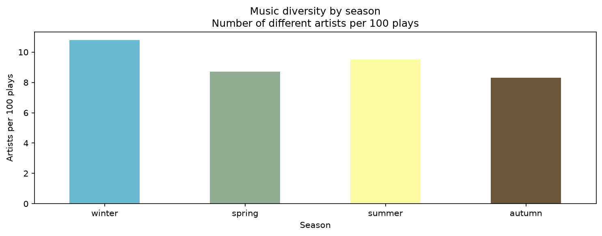
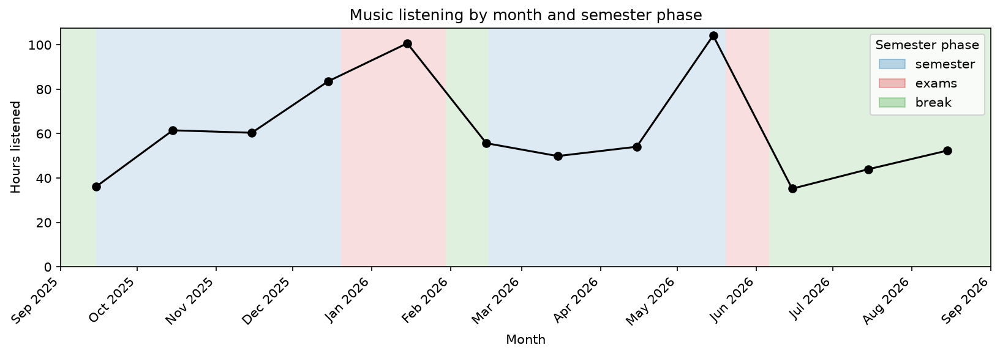
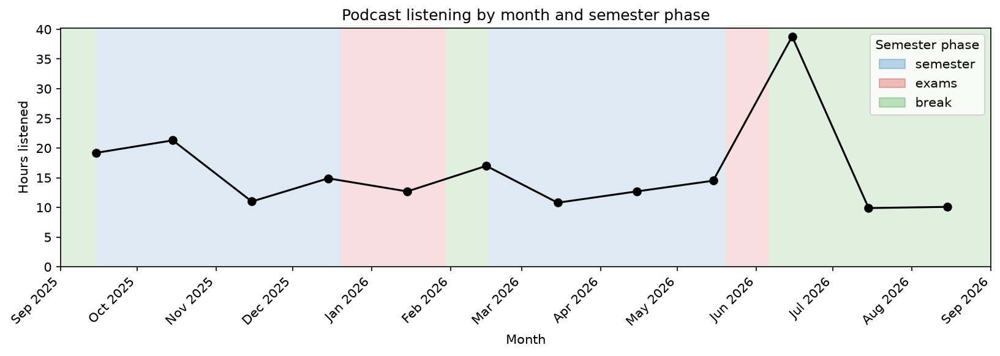

# Spotify Listening Habits

An analysis of my own Spotify "Extended streaming history" (September 2020 – 2026): when I listen, how varied my music is, and how my listening changes during the university year.

**Tools:** Python, pandas, SQL (SQLite), matplotlib

The whole analysis is in the notebook [`analysis.ipynb`](analysis.ipynb).

## Questions

1. How does my music listening vary during the day?
2. Does the diversity of my music change between seasons?
3. Does my music listening activity look different in semester versus exams?
4. Are there daily habits in how I listen to podcasts?
5. Does my podcast listening go down in exam season, the summer break or at the start of new semester?

## Key findings

**Q2: Winter is my most varied season** (about 11 artists per 100 plays, against about 8 in autumn), but the differences are modest.



**Q3: My two busiest months, January and May, both contain exam periods.**



**Q5: Podcast listening is steady during the semester and exams, and drops in the summer break.**



## How it works

1. **Data preparation (pandas):** combined the yearly files, converted timestamps from UTC to Czech time, removed empty and personal columns, removed duplicates, and added columns for hour, month, season and semester phase.
2. **Music and podcasts** are analysed separately. Very short plays are excluded (under 30 seconds for music, under 3 minutes for podcasts).
3. **SQL (SQLite):** both tables are saved into a local database and the questions are answered with SQL queries (`GROUP BY`, `COUNT(DISTINCT ...)`, aggregations).
4. **Charts (matplotlib):** bar and line charts, including a monthly chart with the semester phases as coloured background.

The semester phases use the same approximate dates every year (see the notebook), not the exact official calendar.

## Run it yourself

1. Request your own data in your Spotify account's privacy settings: **Extended streaming history**. Spotify sends a download link by email, which can take some time.
2. The export is delivered as JSON files. `convert_to_csv.py` converts them to CSVs and writes them next the originals. Move the CSVs into `data`.
3. Install the packages: `pip install -r requirements.txt`
4. Open `analysis.ipynb` in Jupyter or VS Code and run all cells. The charts are saved into `images/`.

To use it for your own data, adjust the dates in the `semester_phase` function to your own calendar.

## Project structure

```
analysis.ipynb       the analysis
convert_to_csv.py     converts the Spotify JSON export to CSV
requirements.txt      Python packages
images/               charts shown in this README (created by the notebook)
data/                 my Spotify export, not included (personal data)
spotify.db            created by the notebook, not included
```